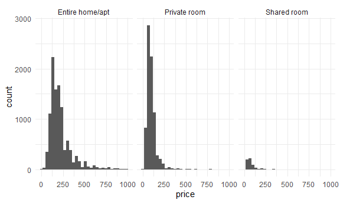

Case Study
================

Today we’re studying a case.

## Get Data

``` r
library(p8105.datasets)

data(nyc_airbnb)

nyc_airbnb = 
  nyc_airbnb %>% 
  rename(borough = neighbourhood_group) %>% 
  mutate(stars = review_scores_location / 2)
```

## Brainstorm questions

-   what variables are relevant to higher review / scores?
-   what are the popular places to rent an air bnb?
-   what portion of hosts / locations are private rooms vs entire
    apartments?
-   what makes an air bnb more expensive?

``` r
most_popular = 
  nyc_airbnb %>%
  group_by(neighbourhood, borough) %>%
  distinct() %>%
  summarize(n_obs = n()) %>%
  ungroup() %>% 
  group_by(borough) %>% 
  mutate(rank = min_rank(desc(n_obs))) %>% 
  filter(rank < 5) %>% 
  arrange(borough, n_obs)
```

    ## `summarise()` has grouped output by 'neighbourhood'. You can override using the
    ## `.groups` argument.

``` r
most_popular
```

    ## # A tibble: 20 × 4
    ## # Groups:   borough [5]
    ##    neighbourhood      borough       n_obs  rank
    ##    <chr>              <chr>         <int> <int>
    ##  1 Longwood           Bronx            33     4
    ##  2 Concourse          Bronx            37     3
    ##  3 Kingsbridge        Bronx            44     2
    ##  4 Mott Haven         Bronx            53     1
    ##  5 Crown Heights      Brooklyn       1329     4
    ##  6 Bushwick           Brooklyn       1937     3
    ##  7 Bedford-Stuyvesant Brooklyn       2850     2
    ##  8 Williamsburg       Brooklyn       3719     1
    ##  9 Hell's Kitchen     Manhattan      1577     4
    ## 10 Upper West Side    Manhattan      1782     3
    ## 11 East Village       Manhattan      1858     2
    ## 12 Harlem             Manhattan      2524     1
    ## 13 Ditmars Steinway   Queens          278     4
    ## 14 Ridgewood          Queens          283     3
    ## 15 Long Island City   Queens          438     2
    ## 16 Astoria            Queens          755     1
    ## 17 Stapleton          Staten Island    17     4
    ## 18 Randall Manor      Staten Island    18     3
    ## 19 Tompkinsville      Staten Island    28     2
    ## 20 St. George         Staten Island    56     1

Let’s look at price …

``` r
nyc_airbnb %>% 
  group_by(borough, room_type) %>% 
  summarize(
    mean_price = mean(price, na.rm = TRUE)
  ) %>% 
  pivot_wider(
    names_from = room_type,
    values_from = mean_price
  )
```

    ## `summarise()` has grouped output by 'borough'. You can override using the
    ## `.groups` argument.

    ## # A tibble: 5 × 4
    ## # Groups:   borough [5]
    ##   borough       `Entire home/apt` `Private room` `Shared room`
    ##   <chr>                     <dbl>          <dbl>         <dbl>
    ## 1 Bronx                      125.           65.5          57.5
    ## 2 Brooklyn                   175.           76.7          59.6
    ## 3 Manhattan                  238.          107.           84.7
    ## 4 Queens                     140.           70.6          49.1
    ## 5 Staten Island              207.           65.4          25

Look at price distributions

``` r
nyc_airbnb %>% 
  filter(
    borough == "Manhattan", 
    price < 1000) %>% 
  ggplot(aes(x = price)) +
  geom_histogram() +
  facet_grid(. ~ room_type)
```

    ## `stat_bin()` using `bins = 30`. Pick better value with `binwidth`.



Price vs … rating?

``` r
nyc_airbnb %>% 
  filter(borough == "Manhattan") %>% 
  ggplot(aes(x = stars, y = price)) + 
  geom_point() +
  facet_grid(. ~ room_type)
```


Somewhat fancy boxplot!

``` r
nyc_airbnb %>% 
  filter(borough == "Manhattan") %>% 
  group_by(neighbourhood) %>% 
  summarize(mean_price = mean(price, na.rm = TRUE)) %>% 
  arrange(desc(mean_price))
```

    ## # A tibble: 32 × 2
    ##    neighbourhood     mean_price
    ##    <chr>                  <dbl>
    ##  1 Tribeca                 353.
    ##  2 Flatiron District       319.
    ##  3 NoHo                    302.
    ##  4 Greenwich Village       258.
    ##  5 SoHo                    256.
    ##  6 Midtown                 251.
    ##  7 West Village            239.
    ##  8 Chelsea                 233.
    ##  9 Theater District        232.
    ## 10 Battery Park City       221.
    ## # … with 22 more rows

``` r
nyc_airbnb %>% 
  filter(
    borough == "Manhattan",
    room_type == "Entire home/apt") %>% 
  filter(price <= 1000) %>% 
  mutate(neighbourhood = fct_reorder(neighbourhood, price)) %>% 
  ggplot(aes(x = neighbourhood, y = price)) + 
  geom_boxplot() +
  coord_flip()
```


Price vs location

``` r
nyc_airbnb %>% 
  filter(
    borough == "Manhattan",
    room_type == "Entire home/apt") %>% 
  filter(price <= 1000) %>% 
  sample_n(2000) %>% 
  ggplot(aes(x = lat, y = long, color = price)) + 
  geom_point(alpha = .5)
```


